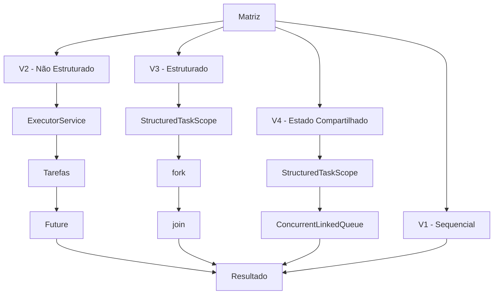

# Projeto AV1 - Programação Paralela, Concorrente e Distribuída

Projeto desenvolvido para a avaliação da disciplina de
**Programação Paralela, Concorrente e Distribuída**.

## Integrantes

- Mateus José Galvão de Melo Guimarães
- Gustavo José Magina Eustachio

## Objetivo

Comparar diferentes estratégias de processamento de uma matriz
computacionalmente custosa, evoluindo de uma solução sequencial
para soluções concorrentes e paralelas.

O projeto parte da implementação sequencial fornecida pelo professor e demonstra a evolução do processamento de uma matriz utilizando diferentes estratégias de concorrência e paralelismo.

O mesmo problema é resolvido através de quatro versões:

1. V1 - Processamento Sequencial
2. V2 - Paralelismo Não Estruturado
3. V3 - Paralelismo Estruturado
4. V4 - Estado Compartilhado

---

## V1 - Processamento Sequencial

A implementação sequencial fornecida pelo professor é utilizada como baseline.

A matriz é percorrida elemento por elemento e cada valor é submetido à função `calcular()`.

---

## V2 - Paralelismo Não Estruturado

A matriz é dividida em N partes.

Cada tarefa fica responsável por um intervalo de linhas.

São utilizados:

- `ExecutorService`
- pool de threads
- `Future`
- `Semaphore`

O `Semaphore` funciona como uma porta de largada: as tarefas são criadas e posteriormente liberadas para execução.

---

## V3 - Paralelismo Estruturado

A mesma divisão da matriz é realizada utilizando:

- `StructuredTaskScope`
- `fork()`
- `join()`
- `Subtask`

As subtarefas pertencem ao mesmo escopo e a thread principal aguarda sua conclusão utilizando `join()`.

---

## V4 - Estado Compartilhado

A quarta versão parte da implementação estruturada e adiciona um estado compartilhado.

É utilizada:

```java
ConcurrentLinkedQueue<Double>
```

Cada subtarefa adiciona seu resultado parcial à mesma coleção concorrente.

Após a conclusão das subtarefas, os resultados são somados pela aplicação principal.

---

# Arquitetura



---

# Experimentos

O projeto utiliza os seguintes tamanhos de matriz:

- 500 x 500
- 1000 x 1000
- 1500 x 1500
- 2000 x 2000

As versões paralelas podem ser executadas com:

- 5 tarefas
- 10 tarefas
- 100 tarefas

Cada implementação é executada **10 vezes**.

O programa apresenta o tempo médio das dez execuções.

---

# Speedup

O speedup é calculado através da fórmula:

```text
Speedup = Tempo médio sequencial / Tempo médio paralelo
```

Valores maiores que `1` indicam que a versão paralela foi mais rápida que o baseline sequencial.

---

# Validação do resultado

Todas as versões utilizam exatamente a mesma matriz.

O resultado das versões paralelas é comparado ao resultado da versão sequencial.

Como a ordem das operações de soma com `double` pode variar em processamento paralelo, a comparação utiliza uma pequena tolerância numérica.

---

# Deadlock

A implementação não utiliza múltiplos locks adquiridos em diferentes ordens.

Na V2, cada tarefa realiza somente um `acquire()` no `Semaphore`.

A thread principal libera um permit para cada tarefa antes de aguardar seus resultados.

Dessa maneira, não existe dependência circular entre recursos.

Na V3 e na V4, as subtarefas estão delimitadas pelo mesmo `StructuredTaskScope`.

---

# Livelock

Não existe mecanismo em que duas tarefas fiquem continuamente modificando seu comportamento em resposta uma à outra.

Também não são utilizados ciclos de tentativa e liberação de locks.

---

# Starvation

Na V2 o `Semaphore` é criado utilizando política justa:

```java
new Semaphore(0, true)
```

Além disso, existe um permit para cada tarefa.

Todas as tarefas executam uma quantidade finita de processamento.

Na V4 é utilizada uma `ConcurrentLinkedQueue`, evitando a necessidade de gerenciamento manual de um lock para atualização da coleção compartilhada.

---

# Como executar

## Requisitos

- Java JDK 25
- IntelliJ IDEA ou terminal
- Preview Features habilitadas para `StructuredTaskScope`

Pelo terminal:

```bash
java --enable-preview --source 25 src/Main.java
```

O programa solicitará primeiro o tamanho da matriz:

```text
1 - Matriz 500 x 500
2 - Matriz 1000 x 1000
3 - Matriz 1500 x 1500
4 - Matriz 2000 x 2000
0 - Sair
```

Em seguida:

```text
Quantidade de tarefas (5, 10 ou 100):
```

O programa executará as quatro versões 10 vezes e apresentará:

- tempo médio;
- speedup;
- validação do resultado.

---

# Resultados Experimentais

Os valores abaixo devem ser preenchidos com os resultados reais obtidos nos experimentos.

| Matriz | Implementação | Tarefas | Tempo médio (ms) | Speedup | Correto |
|---|---|---:|---:|---:|---|
| 500x500 | Sequencial | 1 | 5348,428 | - | SIM |
| 500x500 | Não estruturado | 5 | 1294,132 | 4,133 | SIM |
| 500x500 | Estruturado | 5 | 1103,275 | 4,848 | SIM |
| 500x500 | Estado compartilhado | 5 | 1078,283 | 4,960 | SIM |

Valores obtidos com JDK 25 (Temurin), média de 10 execuções para matriz 500 x 500 e 5 tarefas.

A tabela deverá ser completada após a execução das demais configurações utilizadas pelo grupo.

---
